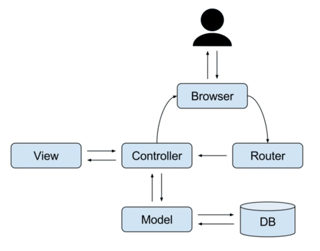

Projekt z laboratorium, kod bez mian.  
Każdy krok w git.  
Repozytorium https://github.com/kzrepo/s6-zaawansowane-serwisy-internetowe-lab-5-6

Dla testów `.gitignore` nie ignoruje niektórych folderów, które powinien

### AUTOMATYCZNE ODŚWIEŻANIE STRONY
1. https://stackoverflow.com/questions/49392001/laravel-project-auto-refresh-after-changes
2. `mix.browserSync('127.0.0.1:8000');` - dodać na końcu pliku webpack.mix.js na końcu
3. `php artisan serve` - najpierw uruchomić serwer artisana
4. `npm run watch` - po uruchomieniu Webpacka za pierwszym razem zostaną zainstalowane potrzebne zależności. Po drugim uruchomieniu wszystko będzie działało.

### JS i CSS kompilowany do app.js
1. `materialize.js` kompilowany jest do app.js za pomocą Webpack. Szczegóły konfiguracji w pliku `resources\js\app.js`.
2. `materialize.css` kompilowany jest do app.js za pomocą Webpack. Szczegóły konfiguracji w pliku `resources\css\app.css`.
3. Konfiguracja Webpack w pliku `wepack.mix.js`

### MVC

